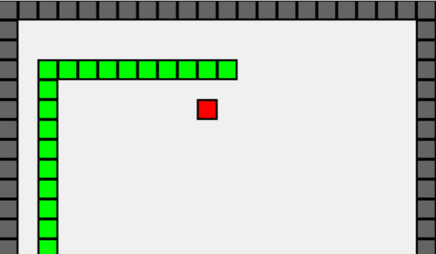

# 🐍 SNAKE

このリポジトリは複数のプログラミング言語でスネークゲームを実装するチャレンジプロジェクトです

## 🔮 計画

| 言語   | UI  | 状態 |
|:------:|:---:|:----:|
| C      | GUI | ✅  |
| Go     | GUI | ✅   |
| Python | GUI | ✅   |
| Java   | GUI | 🚧   |
| HTML5/JS | GUI | 📅 |
| Rust | GUI | 📅 |
| Scala | GUI | 📅 |
| Kotlin | GUI | 📅 |
| C++ | GUI | 📅 |
| C# | GUI | 📅 |

✅ 完了 | 🚧 進行中 | 📅 予定

## 📊 評価

1. 実行速度
2. メモリ使用量
3. 実行ファイルのサイズ

## 📜 ライセンス

このプロジェクトは[MITライセンス](LICENSE)の下で公開されています。
